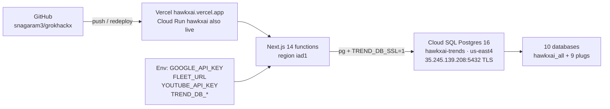
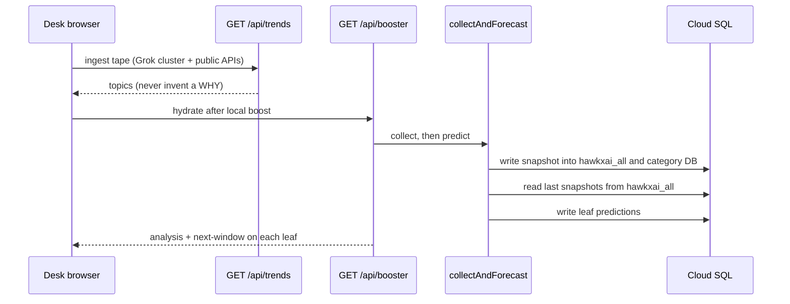
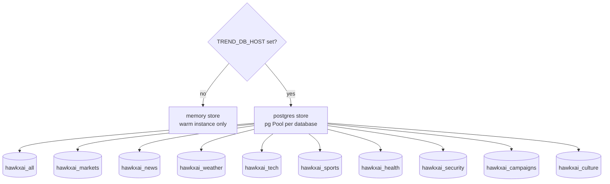

# HawkxAI runtime architecture

Contest poster (use this on Devpost and in the video): [`/architecture`](../app/architecture/page.tsx) or the static export [`public/demo/architecture.html`](../public/demo/architecture.html).

Live mermaid detail: [`/architecture`](../app/architecture/page.tsx). Source of the charts: [`lib/architecture-diagrams.ts`](../lib/architecture-diagrams.ts).

**Stack:** Next.js 14 / React 18 · Vercel `iad1` · Cloud SQL Postgres 16 `us-east4` · ten category databases on one instance.

Hobby has no static egress IPs. Cloud SQL currently allows `0.0.0.0/0` plus this laptop (`35.146.43.76/32`). SSL is `ENCRYPTED_ONLY`. Replace the open range with Vercel Static IPs later.

## Deploy path



| Piece | Value |
|---|---|
| GitHub | `snagaram3/grokhackx` |
| Vercel team / project | `hawk-ai4` / `grokhackx` (`prj_8yCxNZaUrJhVFDL9Ijbp5pqhJ1Gb`) · live `hawkxai.vercel.app` |
| Production | [hawkxai.com](https://hawkxai.com) |
| Function region | `iad1` (Northern Virginia) |
| GCP project (fleet / Cloud Run) | `project-16647bb0-5d45-4404-956` (display **Hawkxai**). Cloud SQL `hawkxai-trends` is a separate instance — reuse it; do not create a second one here. |
| Instance | `hawkxai-trends` · `POSTGRES_16` · `db-g1-small` · `us-east4` |
| Host | `35.245.139.208:5432` (primary). Do not use the outgoing IP as host. |
| User | `postgres` via `TREND_DB_USER` / `TREND_DB_PASSWORD` |

## Collect then predict



`/api/trends` stays the tape. Booster is additive. Mind-map bridges only when the same artifact prints on two names. First ingest is thin; a next-window call needs two snapshots.

## Ten databases on one instance



Each database gets the same tables: `snapshots`, `words`, `sentiments`, `artifacts`, `receipts`, `predictions`. Provision once from the repo root:

```bash
npm run provision:trend-db
```

`GET /api/collect` reports `"backend": "postgres"` when `TREND_DB_HOST` is set.

## Env contract

Local: `.env.local` in the repo root (gitignored). Vercel: Production + Preview **sensitive**; Development cannot be sensitive.

| Variable | Role |
|---|---|
| `TREND_DB_HOST` | Cloud SQL primary IP |
| `TREND_DB_PORT` | `5432` |
| `TREND_DB_USER` | `postgres` |
| `TREND_DB_PASSWORD` | instance password |
| `TREND_DB_SSL` | `1` |
| `TREND_DB_PREFIX` | `hawkxai` |
| `TREND_DB_ADMIN` | admin DB user for provision |

Do **not** run `vercel env pull` over `.env.local` — it replaces the file.

## Later (not now)

- Turn off `0.0.0.0/0` once Vercel Static IPs (Pro) are on `iad1`.
- Keep `35.146.43.76/32` (or the current laptop `/32`) for local provision.
- `--authorized-networks` **replaces** the whole list — always include every IP you still need.
